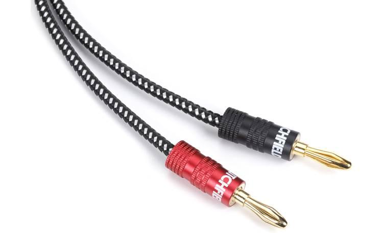
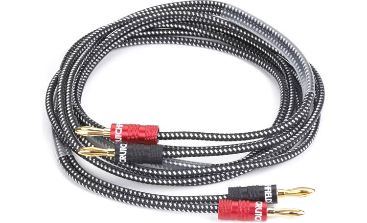

The following details collected from this page https://www.crutchfield.com/p_007CBB6/Crutchfield-Speaker-Wire-6-feet.html from the original purchase.

Our Crutchfield speaker wire with pre-attached banana plugs provides an easy, secure connection between your speakers and receiver or amplifier. The speaker wire is 14-gauge oxygen free copper, and is covered in a flexible nylon jacket. The barrel of each connector has a red or black finish, to easily identify positive or negative.

The positive and negative speaker leads are independent from one another, and are held together by multiple plastic sheaths that can be removed. _**Note:** This package includes a single speaker cable to connect a single speaker. You will need to purchase two of these cables to connect a pair of speakers._

## Product highlights:

- 14-gauge oxygen-free copper wire
- flexible black/silver nylon jacket
- pre-attached banana connectors are gold-plated to resist corrosion
- connectors have red or black barrels to easily identify positive or negative
- _**Note:** this package includes a single speaker cable to connect a single speaker. You will need to purchase two of these cables to connect a pair of speakers_
- warranty: 1 year
- [Our 60-day money-back guarantee](https://www.crutchfield.com/popups/guarantee.aspx)
- MFR # BB-6FT

