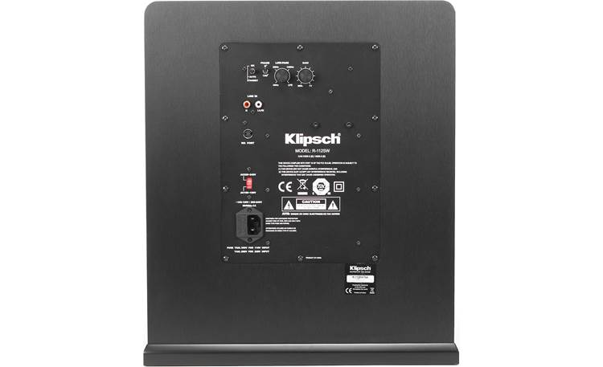
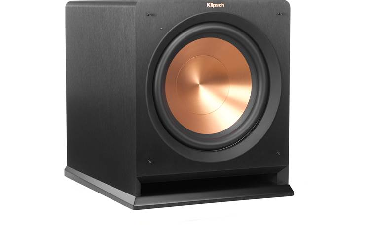
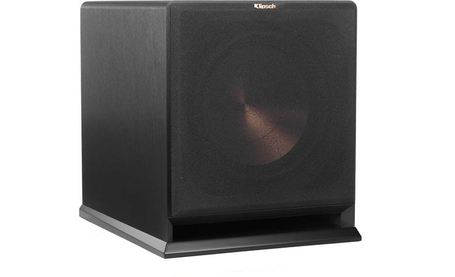
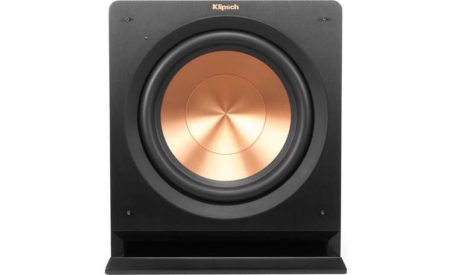
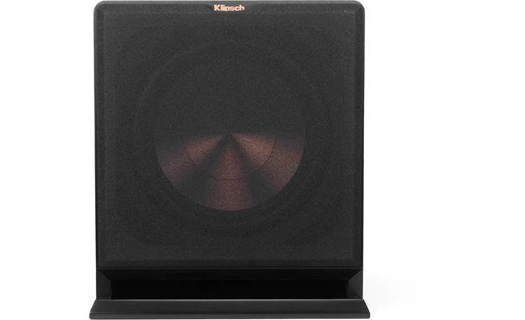

The following details collected from this page https://www.crutchfield.com/p_714R112SW/Klipsch-Reference-R-112SW.html from the original purchase.

## The thunder down under

When the drummer in a concert video takes his solo, you want to feel the vibrations as if you were standing next to the stage. And when aliens attack in your favorite sci-fi flick, you want to feel the floor shake beneath you. Klipsch's R-112SW powered subwoofer provides your home theater with a solid foundation of bass. Its high-output 300-watt amplifier delivers the power to bring your movies, music, and video games to life.

The sub's strong-yet-light 12" Cerametallic™ woofer is designed for quick, precise movement for more accurate sound. Its ceramic-coated aluminum cone helps to dampen unwanted vibrations, while the integrated dust cap adds stability and strength to resist twisting that can cause distortion. The slot-ported cabinet features an internal flare that minimizes port turbulence and noise for cleaner bass. And the front-firing design allows for greater placement flexibility. 

### Easy system integration

Line-level and LFE (Low-Frequency Effects) inputs let you easily connect the R-112SW to almost any home theater or stereo receiver. Its back-panel volume, crossover, and phase controls help you fine-tune the bass to your liking, and blend its sound into your system. The sub comes housed in a durable MDF cabinet finished with a brushed black polymer veneer. A front-mounted LED power indicator makes it easy to tell when the sub is powered up and ready to rock.

## Product highlights:

- Featured in our article: [Best home theater subwoofers for 2023](https://www.crutchfield.com/learn/best-powered-subwoofers.html)
- 300-watt RMS amplifier (600 watts peak power)
- 12" front-firing Cerametallic™ cone woofer
- front slot port with internal flare technology for reduced turbulence and flexible installation
- frequency response: 24-125 Hz
- variable low-pass crossover
- phase switch to fine-tune the subwoofer to your main speakers and room
- line level/LFE (low frequency effects) input
- auto on/off
- compatible with the optional [Klipsch WA-2](https://www.crutchfield.com/p_714WA2/Klipsch-WA-2.html) wireless audio adapter kit (not included) for an easy connection to a sound system
- durable MDF cabinet finished with brushed black polymer veneer
- 15-3/8"W x 17-3/8"H x 20-15/16"D
- weight: 48.75 lbs.
- warranty: 5 years woofer, 2 years amplifier
- [Our 60-day money-back guarantee](https://www.crutchfield.com/popups/guarantee.aspx)
- MFR # 1060700

