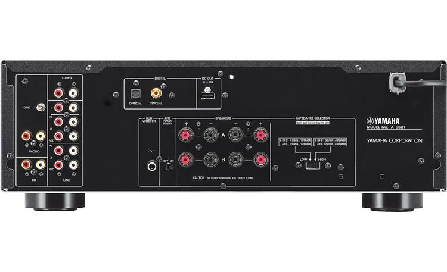
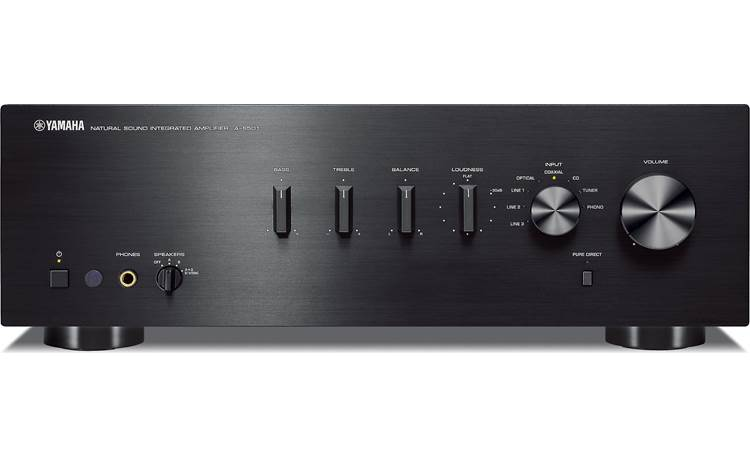
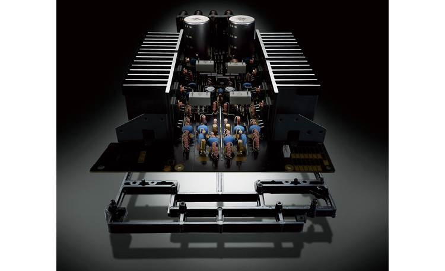
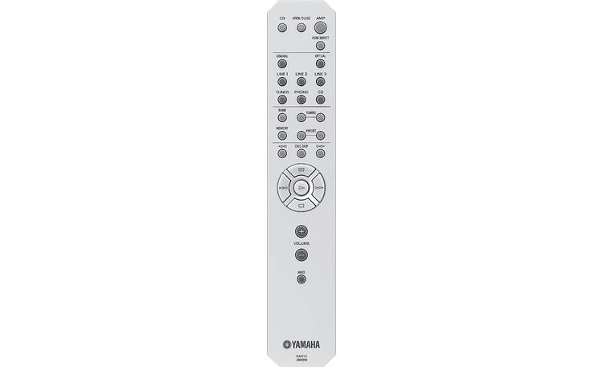

The following details collected from this page https://www.crutchfield.com/p_022AS501B/Yamaha-A-S501-Black.html from the original purchase.

### Power and finesse

Powering your speakers is about more than just brute force. The Yamaha A-S501 offers an excellent balance of power and agility, so your music sounds dynamic and bold without sounding bloated or distorted. In addition to its ample power output, this integrated amplifier employs a symmetrical circuit layout from inputs to outputs, along with an anti-resonance chassis. This keeps distortion and interference from cluttering the signal, for sound that's clean and clear. Your stereo speakers will come to life, for an engaging, detailed performance. Engage Pure Direct listening mode to bypass tone and loudness controls, for an even purer signal.

### Connect your TV and Blu-ray player

The A-S501 has six pairs of analog RCA inputs, including a phono input for connecting a turntable. But music sources aren't the only possibilities: optical and coaxial digital audio inputs let you bring video devices into the fold. Connect a TV or Blu-ray player to these inputs, and enjoy movie sound through your stereo speakers with this amp. It's a cost-effective way to build an excellent two-channel rig in your TV room that offers dynamic sound with a wide stereo image.

### Product highlights:

* 85 watts x 2 channels into 8 ohms (20-20,000 Hz) at 0.019% THD
* 4-ohm capability allows use with a wide range of speakers
* ToP-ART (Total Purity Audio Reproduction Technology) combines a symmetrical circuit layout along with anti-resonance construction for high-quality sound with minimal distortion
* Pure Direct mode allows music signals to travel the shortest possible route through the unit's circuitry for cleaner sound
* optical and coaxial digital audio inputs
* 6 RCA audio inputs, including MM (moving magnet) phono input
* subwoofer output
* two pairs of RCA recording outputs
* signal-to-noise ratio: 99 dB (CD)
* two pairs of gold-plated binding-post speaker connectors with front-panel switching
* 1/4" headphone jack
* remote control
* 17-1/8"W x 6"H x 15-1/4"D
* weight: 22.7 lbs.
* warranty: 2 years
* Our 60-day money-back guarantee
* MFR # A-S501BL

### What's in the box:

* Yamaha A-S501 owner's manual
* Stereo integrated amplifier
* Remote control (RAS13)
* 2 "AA" batteries
* Owner's manual (En/ Fr)
* Warranty information (US/CA)
* On-line product registration information
* "Yamaha Worldwide Representative Offices" note

### More Details

## Features & specs

**Performance Specs**

Watts RMS per Channel (8-ohms)	85
Watts RMS per Channel (6-ohms)	100
Watts RMS per Channel (4-ohms)	Not given
Frequency Bandwidth	20-20k
THD	0.019%
Minimum Impedance	4 ohms
Amplifier Class	AB
Signal to Noise Ratio	99
DAC Bit Depth	24-bit
DAC Sample Rate	192kHz

**Digital Music Features**

Built-in DAC (Digital to Analog Converter)	Yes
Bluetooth	No
Wi-Fi	N/A

**Connections**

Total Analog Inputs	6
Phono Input	Yes
Optical Digital Inputs	1
Coaxial Digital Inputs	1
USB Input	No
Preamp Outputs	Mono-RCA
Recording Output	Yes
Home Theater Bypass	No
Pre-out/Main-in Loop	No
Headphone Output	1/4"
Removable Power Cord	No

**Streaming Compatibility**

Apple AirPlay	No
Apple AirPlay 2	No
DTS Play-Fi	No
Chromecast built-in	No
Roon	No
HEOS	No
BluOS	No

**Dimensions and Warranty**

Width (inches)	17-1/8
Height (inches)	6
Depth (inches)	15-7/16
Weight (pounds)	22.7
Parts Warranty	2 Years
Labor Warranty	2 Years

**The Yamaha A-S501 replaces these items:**

Yamaha A-S500

### Features

"Natural Sound" Concept: Yamaha, with a long history of over 125 years as a musical instrument maker, also has a high reputation for HiFi components. Yamaha's A-S501 integrated amplifier takes advantage of this rich experience and high technological expertise. Based on the concept of "Natural Sound", for reproducing all music as it really sounds, and built with scrupulous care from circuit design to basic sound production, the A-S501 reproduces high sound quality and musically rich sound.

Proprietary Yamaha Technologies: The Yamaha AS-501 integrated amplifier employs proprietary Yamaha technologies for optimum performance and sound reproductions.

ToP-ART Design: When processing and transmission of the audio signal is simple and direct there is less chance of it being affected by noise and distortion. Yamaha's amplifier design technology called "ToP-ART" features an I/O (input to output) Direct Symmetrical Design, with left and right channels organized in a straight, symmetrical layout for highest signal purity.
ART (Anti-Resonance and Tough): In addition, the ART (Anti-Resonance and Tough) Base bottom chassis and a solid center bar provide high-rigidity support and vibration damping.
High Current Amplifier: The Yamaha A-S501 features a dynamic, high current stereo amplifier with low impedance drive capability. The amp is rated at 85 watts x 2-channels, measured from 20-20 kHz into 8Ω with 0.019% THD (100 watts x 2-channels, measured from 20-20 kHz into 6Ω with 0.038% THD).

High Quality Parts: Custom-made power transformer, custom-made block capacitors, two direct signal path speaker relays, one-point grounding system, aluminum-extruded heat sinks and other top-quality parts effortlessly handle demanding audio signal conditions. The quality of each individual part, as well as how they work together, basically determines the sound quality of any component. Yamaha uses only very high quality parts, carefully selected and tested.

Sophisticated Front-Panel Design: With a beautifully simple and unique design inherited directly from Yamaha's HiFi audio components, this amplifier also boasts an easy-to-operate button layout. The aluminum front-panel has a richly textured silver hairline finish. The control knobs are also of the same luxurious construction as used on our top-end models. The rotary encoder makes it quick and easy to select input sources. The luxury hairline finish material offers a nice tactile feeling. LEDs clearly show which source is selected, so you can easily switch sources even in a dark room

### Controls

Pure Direct Mode: The Pure Direct mode causes the music signals to travel the shortest possible circuit route, bypassing the buffer amp and the tone, loudness and balance controls to virtually eliminate any signal degradation for the purest sound quality.

Variable Loudness Control: The A-S501 also features a new analog loudness control on the front-panel that uses electronic volume for higher sound quality, which lets you adjust the loudness effect as desired. Separate from the overall volume, this controls the balance of the low- and high- frequency sounds, providing full tonal range at any volume level; compensating for the natural loss in the human ear of high and low frequencies at soft levels.

Tone Controls: The integrated amplifier features independent bass (20Hz-400Hz band) and treble (3.5kHz-20kHz band) controls so you can increase or decrease the low band and high band frequency response (+/-10dB). The entire low and high bands are increased or decreased (you cannot indicate a specific center frequency for bass & treble). You can also adjust the output balance of the left and right speakers.

Impedance Switch: The integrated amplifier features a rear-panel impedance switch to match the impedance level of the speakers connected. Choose High or Low:

High: Select High if using one set (A or B) of speakers with impedance of 6-ohm or higher; when bi-wiring the impedance of the speaker must also be 6-ohms or higher.
Low: Select Low if using one set (A or B) of speakers with the impedance of 4-ohm to 6-ohm; if using two sets (A and B) of speakers simultaneously, the impedance of each speaker must be at least 8-ohms; when bi-wiring the impedance of the speaker must also be 4-ohms to 6-ohms.
Simple Remote Control: The clean, simple design of the remote control provides easy-to-understand one-hand operation. The easy-to-use design makes it simple to adjust song volume and order. The remote has a sophisticated looking hairline finish that matches the design of the amplifiers. You can also use the remote to control a Yamaha CD/SACD player.

Auto Power Standby: The amplifier has a power management function that detects when it hasn't been used for a long time (about 8 hours) even though the power is on, and automatically shifts it into standby mode. So even if you forget to turn it off, power consumption will be minimized.

### Connections

Gold-Plated Terminals: The Yamaha A-S501 has gold-plated terminals for all of its inputs and outputs. These gold-plated terminals ensure a high quality connection that prevents signal loss.

Analog & Digital Inputs: The Yamaha A-S501 integrated amplifier offers analog & digital inputs for connection of a variety of home audio components.

RCA + Phono: The Yamaha integrated amplifier is equipped with six analog stereo (RCA) inputs for connecting external analog audio sources, including a turntable. The Phono input can be used to connect a turntable with an MM phono cartridge to play vinyl records. The unit's Phono input also features a ground terminal.
Optical & Coaxial Digital Inputs: The A-S501 is equipped with both optical (toslink) and coaxial (RCA) digital audio inputs. The optical and coaxial inputs will accept 2ch PCM (not Dolby Digital/DTS). The audio stays in the digital domain, giving you pure, pristine dynamic sound for all your entertainment sources, from sports and other programs to movies and concerts.
Recording Outputs: There are also two pair of RCA outputs for recording audio through the amplifier to recording device.

A & B Speaker Terminals: The Yamaha integrated amplifier features binding post terminals for its A & B speaker outputs. You can use the A & B speaker outputs to power two pair of speakers, or bi-wire a single pair of compatible speakers. The terminals are not 5-way binding posts because a plastic collar prevents their use with spade lugs and they are too far apart for dual banana plugs.

Sub Output: A terminal for connecting a subwoofer is provided, allowing you to increase the bass output of your system for a more powerful sound with better overall sound quality

Headphone Output: The A-S501 integrated amplifier is equipped with a front-panel 1/4" headphone output for connecting a pair of headphones (sold separately). When a set of headphones is plugged in, the speaker outputs are automatically muted.

